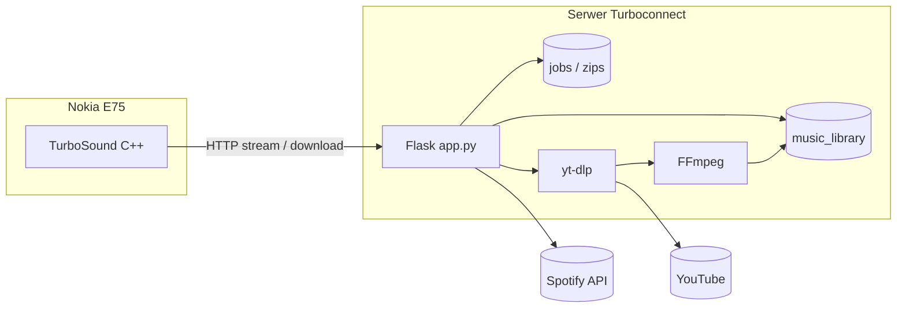

# Turboconnect / TurboSound

**Ożyw starego Symbiania** — pełnoprawny odtwarzacz muzyki na Nokia E75 (S60 3rd Edition FP2) z backendem Flask do streamingu, pobierania utworów i importu playlist ze Spotify.

> Projekt łączy aplikację natywną w C++ (Symbian SDK / Carbide.c++) z serwerem webowym, który obsługuje bibliotekę audio, playlisty, konwersję formatów i asynchroniczny import ze Spotify (YouTube → MP3 przez `yt-dlp` + FFmpeg).

---

## Funkcje

### Aplikacja Symbian (TurboSound)
- Odtwarzanie lokalnych plików audio z karty pamięci (`E:\Muzyka\`)
- Streamowanie utworów z serwera Turboconnect (HTTP — wymagane przez stos TLS na E75)
- Pobieranie utworów z serwera na telefon
- Obsługa klawiszy głośności bocznych (RemCon API)
- Zapamiętywanie sesji odtwarzania (wznowienie po restarcie)
- Wyszukiwanie i filtrowanie lokalnej biblioteki

### Serwer Flask
- Panel WWW: logowanie, biblioteka, odtwarzacz, playlisty
- REST API kompatybilne z klientem Symbian
- Pobieranie audio z YouTube (`yt-dlp`)
- Import playlist Spotify → ZIP z utworami (w tle, ze śledzeniem postępu)
- Konwersja M4A → MP3 (FFmpeg)
- Health check (`/healthz`) pod hosting / Passenger WSGI

### Gateway (prototyp)
- `gateway.py` — lekka bramka HTML pod przeglądarkę Nokii (symulacja czatów WhatsApp, kierunek rozwoju Turboconnect)

---

## Stack technologiczny

| Warstwa | Technologie |
|---------|-------------|
| Klient mobilny | C++, Symbian OS / S60 3rd, Avkon, Multimedia Framework, HTTP client |
| Backend | Python 3, Flask, Werkzeug |
| Audio | FFmpeg, yt-dlp |
| Integracje | Spotify Web API (Client Credentials) |
| Deploy | Passenger WSGI (`passenger_wsgi.py`) |

---

## Architektura



---

## Struktura repozytorium

```
├── src/              # Kod źródłowy aplikacji Symbian (C++)
├── inc/              # Nagłówki
├── data/             # Zasoby RSS (UI, stringi)
├── group/            # bld.inf, TurboSound.mmp — konfiguracja buildu Carbide
├── gfx/              # Ikona aplikacji (SVG → MIF)
├── help/             # Pomoc wbudowana
├── sis/              # PKG / rejestracja backupu
├── server/           # Backend Flask
│   ├── app.py
│   ├── passenger_wsgi.py
│   ├── templates/
│   ├── static/
│   ├── music_library/
│   ├── zips/
│   └── jobs/
└── gateway.py        # Prototyp bramki WWW dla Nokii
```

---

## Uruchomienie serwera (lokalnie)

```bash
cd server
python3 -m venv .venv
source .venv/bin/activate
pip install -r requirements.txt

# Skopiuj i uzupełnij zmienne środowiskowe
cp .env.example .env

# Wymagany FFmpeg w PATH lub zmienna FFMPEG_PATH
export FFMPEG_PATH=/usr/bin/ffmpeg

python app.py
```

Domyślne konto (zmień w `.env` przed produkcją): `admin` / `admin`.

Panel: `http://127.0.0.1:5000`  
Health: `http://127.0.0.1:5000/healthz`

### Hosting (Passenger)

Punkt wejścia WSGI: `server/passenger_wsgi.py` → eksportuje `application`.

Ustaw zmienne środowiskowe na hostingu (patrz `server/.env.example`).

---

## Zmienne środowiskowe

| Zmienna | Opis |
|---------|------|
| `TURBOCONNECT_SECRET` | Klucz sesji Flask (opcjonalnie — inaczej `secret.key`) |
| `TURBOCONNECT_USER` | Login do panelu (domyślnie `admin`) |
| `TURBOCONNECT_PASS` | Hasło do panelu |
| `TURBOCONNECT_DEBUG` | `1` = pełny traceback w błędach 500 |
| `FFMPEG_PATH` | Ścieżka do binarki FFmpeg |
| `SPOTIFY_CLIENT_ID` | Spotify Developer — import playlist |
| `SPOTIFY_CLIENT_SECRET` | Spotify Developer — import playlist |
| `SPOTIFY_MARKET` | Opcjonalny kod rynku (np. `PL`) |

---

## Build aplikacji Symbian

Wymagania: **Nokia Carbide.c++** / Symbian SDK, target **GCCE ARMv5** (S60 3rd Edition).

1. Otwórz projekt w Carbide (`.project`, `.cproject`, `group/bld.inf`).
2. Zbuduj target `TurboSound_0xE650F19F`.
3. Spakuj SIS z `sis/TurboSound_S60_3_X_v_1_0_0.pkg`.
4. W `src/TurboSoundAppUi.cpp` ustaw `KServerBaseUrl` na adres Twojego serwera (HTTP).

> **Uwaga TLS:** Nokia E75 (S60 9.2 FP2) nie obsługuje nowoczesnego TLS wystarczająco do HTTPS na współczesnych hostach. Backend musi być dostępny po **HTTP** bez wymuszonego przekierowania na HTTPS.

---

## API (wybrane endpointy)

| Endpoint | Opis |
|----------|------|
| `GET /healthz` | Status serwera i zależności |
| `GET /library/stream/<id>` | Stream audio dla klienta Symbian |
| `GET /library/file/<id>` | Pobranie pliku |
| `GET /api/search_plain` | Wyszukiwanie w bibliotece |
| `GET /api/fetch` | Pobranie utworu z YouTube do biblioteki |
| `POST /api/spotify_start` | Start importu playlisty Spotify |
| `GET /api/spotify_status/<job_id>` | Postęp importu |
| `GET /api/spotify_zip/<name>` | Pobranie gotowego ZIP |

Pełna lista tras w `server/app.py`.

---

## Autor

**Bartosz Grzanka** — projekt portfolio / hobby retro-mobile.

---

## Licencja

MIT — patrz [LICENSE](LICENSE).
